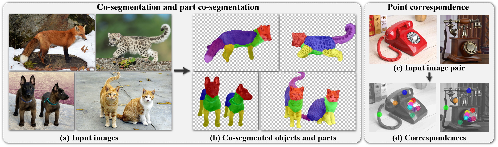

# dino-vit-features
[[paper](https://arxiv.org/abs/2112.05814)] [[project page](https://dino-vit-features.github.io)]

Official implementation of the paper "Deep ViT Features as Dense Visual Descriptors".



>We demonstrate the effectiveness of deep features extracted from a self-supervised, pre-trained ViT model (DINO-ViT) as dense patch descriptors via real-world vision tasks: 
(a-b) co-segmentation & part co-segmentation: given a set of input images (e.g., 4 input images), we automatically co-segment semantically
common foreground objects (e.g., animals), and then further partition them into common parts; (c-d) point correspondence:
given a pair of input images, we automatically extract a sparse set of corresponding points. We tackle these tasks by applying
only lightweight, simple methodologies such as clustering or binning, to deep ViT features.

## Setup
Our code is developed in `pytorch` on and requires the following modules: `tqdm, faiss, timm, matplotlib, pydensecrf, opencv, scikit-learn`.
We use `python=3.9` but our code should be runnable on any version above `3.6`.
We recomment running our code with any CUDA supported GPU for faster performance.
We recommend setting the running environment via Anaconda by running the following commands:
```
$ conda env create -f env/dino-vit-feats-env.yml
$ conda activate dino-vit-feats-env
```
Otherwise, run the following commands in your conda environment:
```
$ conda install pytorch torchvision torchaudio cudatoolkit=11 -c pytorch
$ conda install tqdm
$ conda install -c conda-forge faiss
$ conda install -c conda-forge timm 
$ conda install matplotlib
$ pip install opencv-python
$ pip install git+https://github.com/lucasb-eyer/pydensecrf.git
$ conda install -c anaconda scikit-learn
```

## ViT Extractor

### Code Snippet
```
from extractor import ViTExtractor
extractor = ViTExtractor()
# imgs should be imagenet normalized tensors. shape BxCxHxW
descriptors = extractor.extract_descriptors(imgs) 
```
---
We provide a wrapper class for a ViT model to extract dense visual descriptors in `extractor.py`.
You can extract descriptors to `.pt` files using the following command:
```
python extractor.py --image_path <image_path> --output_path <output_path>
```
You can specify the pretrained model using the `--model` flag with the following options:
* `dino_vits8`, `dino_vits16`, `dino_vitb8`, `dino_vitb16` from the [DINO repo](https://github.com/facebookresearch/dino).
* `vit_small_patch8_224`, `vit_small_patch16_224`, `vit_base_patch8_224`, `vit_base_patch16_224` from the [timm repo](https://github.com/rwightman/pytorch-image-models/tree/master/timm).

You can specify the stride of patch extracting layer to increase resolution using the `--stride` flag.

## Part Co-segmentation [](http://colab.research.google.com/github/shiramir/dino-vit-features/blob/main/part_cosegmentation.ipynb)
We provide a notebook for running on a single example in `part_cosegmentation.ipynb`. 

To run on several image sets, arrange each set in a directory, inside a data root directory:

```
<sets_root_name>
|
|_ <set1_name>
|  |
|  |_ img1.png
|  |_ img2.png
|   
|_ <set2_name>
   |
   |_ img1.png
   |_ img2.png
   |_ img3.png
...
```
The following command will produce results in the specified `<save_root_name>`:
```
python part_cosegmentation.py --root_dir <sets_root_name> --save_dir <save_root_name>
```

**Note:** The default configuration in `part_cosegmentation.ipynb` is suited for running on small sets (e.g. < 10). Increase amount of `num_crop_augmentations` for more stable results (and increased runtime). The default configuration in `part_cosegmentation.py` is suited for larger sets (e.g. >> 10).

## Co-segmentation [](http://colab.research.google.com/github/shiramir/dino-vit-features/blob/main/cosegmentation.ipynb)
We provide a notebook for running on a single example in `cosegmentation.ipynb`. 

To run on several image sets, arrange each set in a directory, inside a data root directory:

```
<sets_root_name>
|
|_ <set1_name>
|  |
|  |_ img1.png
|  |_ img2.png
|   
|_ <set2_name>
   |
   |_ img1.png
   |_ img2.png
   |_ img3.png
...
```
The following command will produce results in the specified `<save_root_name>`:
```
python cosegmentation.py --root_dir <sets_root_name> --save_dir <save_root_name>
```


## Point Correspondences [](http://colab.research.google.com/github/shiramir/dino-vit-features/blob/main/correspondences.ipynb)
We provide a notebook for running on a single example in `correpondences.ipynb`. 

To run on several image pairs, arrange each image pair in a directory, inside a data root directory:

```
<pairs_root_name>
|
|_ <pair1_name>
|  |
|  |_ img1.png
|  |_ img2.png
|   
|_ <pair2_name>
   |
   |_ img1.png
   |_ img2.png
...
```
The following command will produce results in the specified `<save_root_name>`:
```
python correspondences.py --root_dir <pairs_root_name> --save_dir <save_root_name>
```

## Other Utilities
### PCA
We provide code for computing the PCA of several images in a single directory:
```
python pca.py --root_dir <images_root_name> --save_dir <save_root_name>
```

### Similarity Inspection
We provide code for interactively visualizing the similarity of a chosen descriptor in the source image to all target descriptors in a terget image.
```
python inspect_similarity --image_a <path_to_image_a> --image_b <path_to_image_b>
```


## Citation
If you found this repository useful please consider starring ⭐ and citing :
```
@article{amir2021deep,
    author    = {Shir Amir and Yossi Gandelsman and Shai Bagon and Tali Dekel},
    title     = {Deep ViT Features as Dense Visual Descriptors},
    journal   = {arXiv preprint arXiv:2112.05814},
    year      = {2021}
}
```
